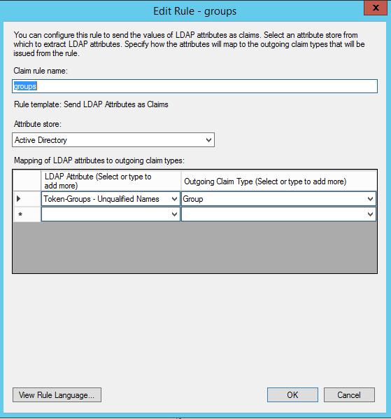

.. _adfs-attribmapping-ug:

==========================
Attribute Mapping for ADFS
==========================

If you want both the groups that a user belongs to appear in the SAML
attributes and the assertions to be sent to Rackspace (so they can be
mapped into permissions, you should include any groups to which a user
belongs that will be mapped into a Rackspace role or permission.

The following steps demonstrate attribute mapping for ADFS:

1. Go to the Claim rules for the Rackspace Relying Party Trust that you 
setup.

.. image: ADFS_Step4_edited.png

|

2. Add a new rule Select "Token-Groups - Unqualified Names" for the LDAP
Attribute and an outgoing claim type of "Group".

|

To learn more about how to customize how you include
active directory group membership in your SAML attributes, see
`https://msdn.microsoft.com/en-us/library/ff359101.aspx
<https://msdn.microsoft.com/en-us/library/ff359101.aspx>`_

The following example shows a Rackspace YAML ``.yml`` attribute mapping policy
that you can use when you configure your identity provider with Rackspace. This
example assumes you have a group named ``rackspace-billing`` with users that
you want to access Rackspace billing services using the ``billing:admin``
Rackspace role.

Notes:

- The ``groups`` specified in the example should be changed to match your
  configured outgoing claim type for the active directory groups.
- Remember to update *at a minimum* the ``domain`` value to your Identity
  Domain from the |idp| details page.
- Validate that any values being mapped to ``email`` and ``expire`` are
  properly specified for your specific SAML attributes or assertions. For
  example, in policy below, ``email`` is being set using the
  ``path``/``"{Pt}`` syntax in the |amp| language to point to the ``NameID``
  attribute in the SAML assertion.

.. code-block:: yaml

   ---
   mapping:
     rules:
       -
         local:
           faws:
             groups:
               multiValue: true
               value: "{Ats(http://schemas.xmlsoap.org/claims/Group)}"
           user:
             domain: "your_domain_id_goes_here"
             # Update to your Identity Domain from the Identity Provider details page
             email: "{Pt(/saml2p:Response/saml2:Asertion/saml2:Subject/saml2:NameID)}"
             expire: PT4H
             # This would configure a maximum session duration of 4 hours, you may wish to set this to a SAML provided value
             name: "{D}"
             # This value will match to the SAML attribute "name" by default.
             roles:
               - "{0}"
         remote:
           -
             multiValue: true
             path: |
                 (
                   if (mapping:get-attributes('http://schemas.xmlsoap.org/claims/Group')='rackspace-billing')then    'billing:admin' else ()
                 )
             # The groups specified here are examples. You should substitute your own groups
     version: RAX-1

Be sure to validate and modify the following items in your own policy |amp|:

- The "Active Directory" groups users belong to that you want to map to
  specific Rackspace permissions.
- The ``expire`` value/path
- The ``email`` value/path

|ampref|
