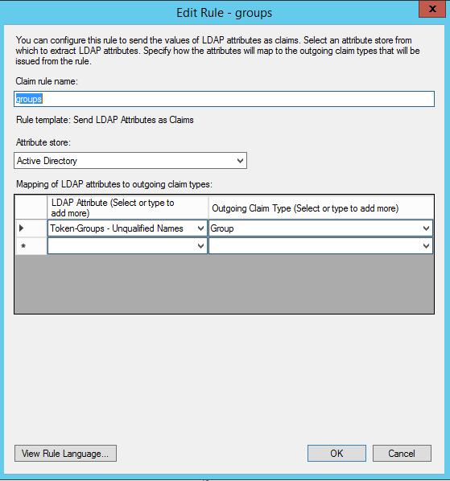

.. _adfs-attribmapping-ug:

Attribute mapping for ADFS
--------------------------

The normal method for mapping ADFS users to Rackspace roles or permissions is
to use ADFS Groups. This guide gives an example of setting up your |amp| to
send both the ADFS Groups to which users belong and user information as SAML
assertions for proper mapping.

Use the following steps for ADFS attribute mapping:

1. Go to the **Claim rules** for the Rackspace relying-party trust that you
   set up, as shown in the following image:

.. image:: ../../_images/Config-ADFS/ADFS_Step4_edited.png

|

2. Add a new rule for the **LDAP Attribute** named
   **Token-Groups - Unqualified Names** with an **Outgoing Claim Type** of
   **Group**, as shown in the following image:

|

|

To learn more about customizing how you include Active Directory group
membership in your SAML attributes, see
`https://msdn.microsoft.com/en-us/library/ff359101.aspx
<https://msdn.microsoft.com/en-us/library/ff359101.aspx>`_

The following example shows both Rackspace XML (``.xml``) as well as
YAML (``.yml``) Attribute Mapping Policy that you can use when you
configure your Identity Provider with Rackspace. This example assumes
that you have a group named ``rackspace-billing`` with users who you
want to access Rackspace billing services by using the ``billing:admin``
Rackspace role.

More information
~~~~~~~~~~~~~~~~

When you map ADFS users to Rackspace roles or permissions, ensure that you
perform the following tasks:

- Change the ``groups`` specified in the example to match your
  configured outgoing claim type for the ADFS groups.
- At a minimum, remember to update the example's ``domain`` value to your
  Identity Domain, which is found on the **Details** page for the |idp|.
- Validate that any values that are mapped to ``email`` and ``expire`` are
  properly specified for your specific SAML attributes or assertions. For
  example, in the following example policy, ``email`` is set by using the
  *path* (``"{Pt}"``) syntax in the |amp| language to point to the ``NameID``
  attribute in the SAML assertion, as shown in the following example:

XML Example:

.. code-block:: xml

      1 <mapping xmlns="http://docs.rackspace.com/identity/api/ext/MappingRules" version="RAX-1" xmlns:saml2="urn:oasis:names:tc:SAML:2.0:assertion" xmlns:xs="http://www.w3.org/2001/XMLSchema" xmlns:xsi="http://www.w3.org/2001/XMLSchema-instance">
      2 <rules>
      3 <rule>
      4 <local>
      5 <user>
      6 <domain value="your_domain_id_goes_here"/>
      7 <name value="{D}"/>
      8 <email value="{Pt(/saml2p:Response/saml2:Assertion/saml2:Subject/saml2:NameID)}"/>
      9 <roles value="{0}"/>
      10 <expire value=""/>
      11 </user>
      12 <faws xsi:type="LocalAttributeGroup"> <groups value="{Ats(groups)}" multiValue="true" xsi:type="LocalAttribute"/>
      13 </faws>
      14 </local>
      15 <remote>
      16 <attribute path="(if (mapping:get-attributes('groups')='rackspace-billing') then 'billing:admin' else ())" multiValue="true"/>
      17 </remote>
      18 </local>
      19 </rule>
      20 </rules>
      21 </mapping>

YAML Example:

.. code-block:: yaml

    mapping:
      rules:
        - local:
            faws:
              groups:
                multiValue: true
                value: "{Ats(http://schemas.xmlsoap.org/claims/Group)}"
            user:
              domain: "your_domain_id_goes_here"
              # Update to your Identity Domain from the Identity Provider details page
              email: "{Pt(/saml2p:Response/saml2:Assertion/saml2:Subject/saml2:NameID)}"
              expire: PT4H
              # This would configure a maximum session duration of 4 hours, you might want to set this to a SAML-provided value
              name: "{D}"
              # This value matches to the SAML attribute "name" by default.
              roles:
                - "{0}"
              # This substitution states to take the value of the return from the first element of the remote role.
          remote:
            - multiValue: true
              path: |
                  (
                    if (mapping:get-attributes('http://schemas.xmlsoap.org/claims/Group')='rackspace-billing')then    'billing:admin' else ()
                  )
              # The groups specified here are examples. You should substitute your own groups.
      version: RAX-1

- Ensure that you validate and modify the following items in your own |amp|:

  - The ADFS groups that users belong to and to which you want to
    map specific Rackspace permissions
  - The ``expire`` value or path
  - The ``email`` value or path

|ampref|
