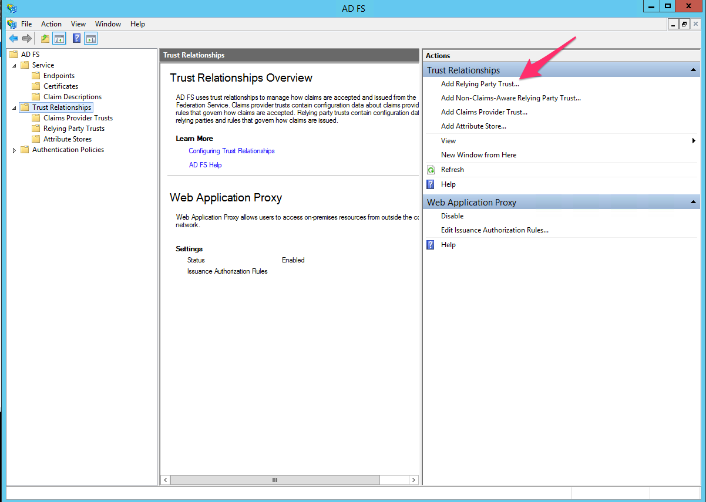
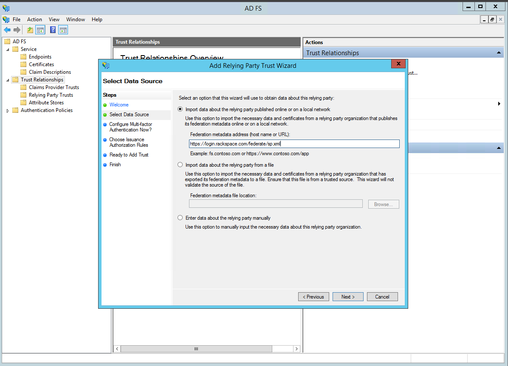
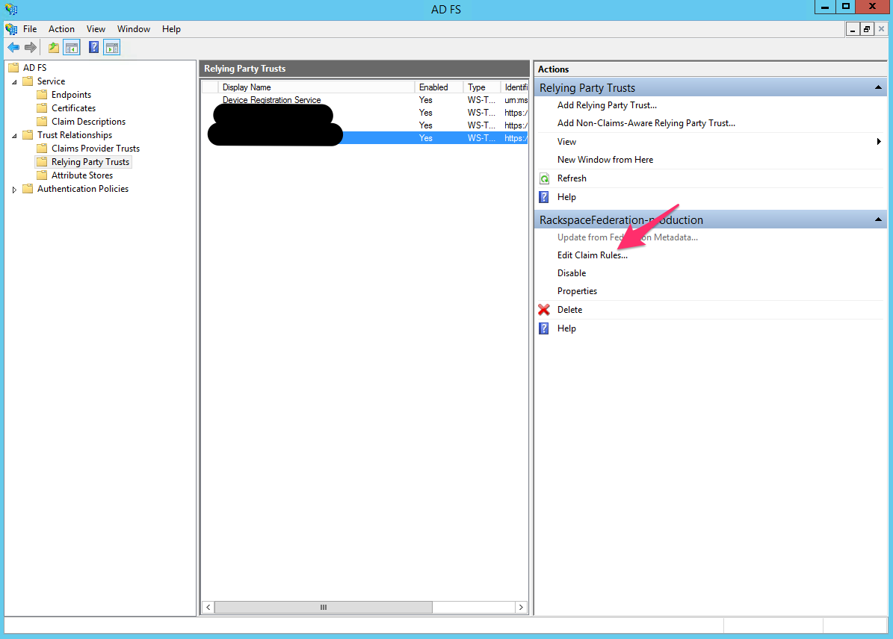
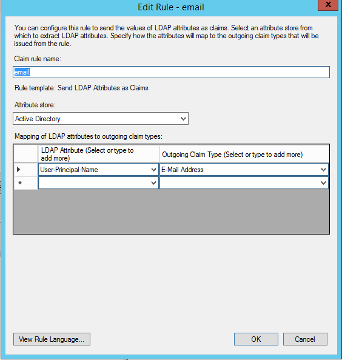
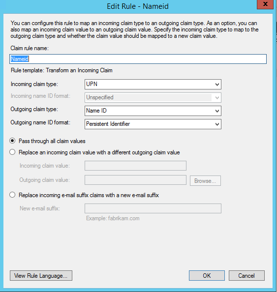

.. _adfs-setup-ug:

================
Configuring ADFS
================

These are the steps to setup an ADFS relying party trust with Rackspace.

1. Click on the 'Add Relying Party Trust' in your ADFS Management Console.

|

2. You can import the rackspace metadata via the url
`https://login.rackspace.com/federate/sp.xml
<https:login.rackspace.com/federate/sp.xml>`_ or by downloading the
``sp.xml`` metadata file locally and uploading it in ADFS.

|

3. Once you have created the rackspace relying party trust, edit the claim
rules for that trust.

|

4. Create a claim rule for email and use the User-Principle-Name as an outgoing
claim type.

|

5. Create outgoing claim of type Name ID.

