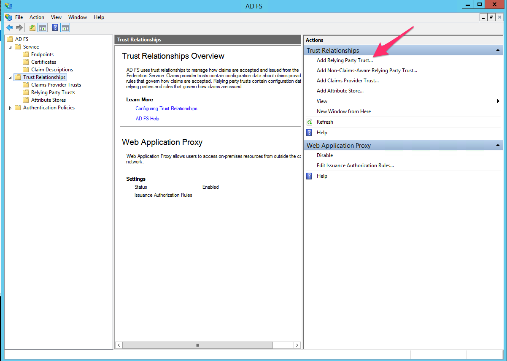
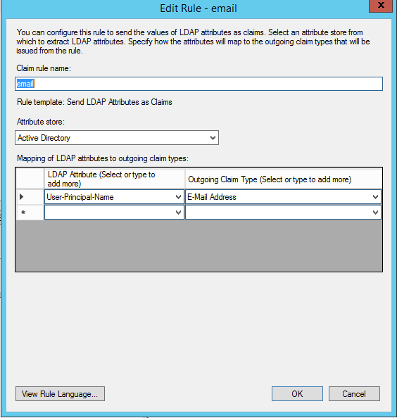
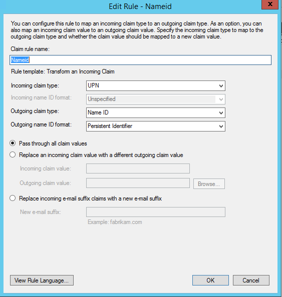

.. _adfs-setup-ug:

Configure ADFS
--------------

Use the following steps to set up an ADFS-relying party trust with Rackspace.

1. Click **Add Relying Party Trust** in your ADFS Management Console.

|

2. Import the Rackspace metadata by using
`https://login.rackspace.com/federate/sp.xml
<https://login.rackspace.com/federate/sp.xml>`_ or by downloading the
`https://login.rackspace.com/federate/sp.xml
<https://login.rackspace.com/federate/sp.xml>`_ metadata file locally and then
uploading it in ADFS.

.. image:: ../../_images/Config-ADFS/ADFS_step_2.png

|

3. After you have created the Rackspace-relying party trust, edit the claim
rules for that trust.

.. image:: ../../_images/Config-ADFS/ADFS_Step4_edited.png

|

4. Create an **Issuance Transform Rules** claim rule for email, and use the
**User-Principle-Name** as an outgoing claim type.

|

5. Create outgoing claim of type **Name ID**.

