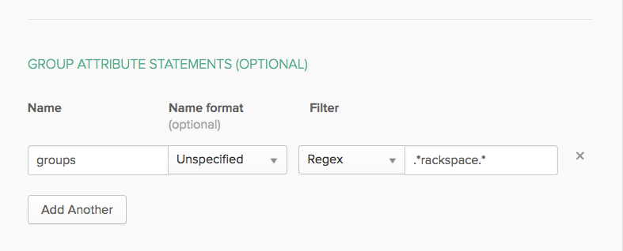

.. _okta-attribmapping-ug:

==========================
Attribute Mapping for Okta
==========================

If you want the groups that a user belongs to appear in the SAML attributes and
the assertions to be sent to Rackspace so that they can be mapped into permissions,
you might need to customize the group attribute statements Okta uses to include group
membership. You can do this at the same time that you configure the SAML application
in the **Group Attribute Statements** or edit an existingapplication by going to your
Admin panel and modifying the **Group Attribute Statements**.

For example, if you want to include all groups that a user belongs to with the
word ``rackspace`` in your SAML assertions, add a field with an appropriate
name such as ``groups`` and then select a regex filter with the value
``.*rackspace.*``.

|

The following example shows a Rackspace YAML ``.yml`` attribute mapping policy
that you can use when you configure your identity provider with Rackspace. This
example assumes that you have a group named ``rackspace-billing`` with users you
want to access Rackspace billing services by using the ``billing:admin``
Rackspace role.

Notes:

- The ``groups`` specified in the example should be changed to match your
  configured Okta groups.
- Remember to update *at a minimum* the ``domain`` value to your Identity
  Domain from the |idp| details page.
- Validate that any values being mapped to ``email`` and ``expire`` are
  properly specified for your specific SAML attributes/assertions. For example,
  in policy below, ``email`` is being set using the ``path``/``"{Pt}`` syntax
  in the |amp| language to point to the ``NameID`` attribute in the SAML
  assertion.

.. code-block:: yaml

   ---
   mapping:
     rules:
       -
         local:
           faws:
             groups:
               multiValue: true
               value:
                 - "{Ats(groups)}"
           user:
             domain: "your_domain_id_goes_here"
             # Update to your Identity Domain from the Identity Provider details page
             email: "{Pt(/saml2p:Response/saml2:Asertion/saml2:Subject/saml2:NameID)}"
             expire: PT4H
             # This would configure a maximum session duration of 4 hours, you may wish to set this to a SAML provided value
             name: "{D}"
             # This value will match to the SAML attribute "name" by default.
             roles:
               - "{0}"
         remote:
           -
             multiValue: true
             path: |
                 (
                   if (mapping:get-attributes'groups')='rackspace-billing')then    'billing:admin' else ()
                 )
             # The groups specified here are examples. You should substitute your own groups
     version: RAX-1

Be sure to validate and modify the following items in your own policy |amp|:

- The Okta groups that users belong to and which you want to map to specific Rackspace
  permissions.
- The ``expire`` value/path
- The ``email`` value/path

|ampref|
