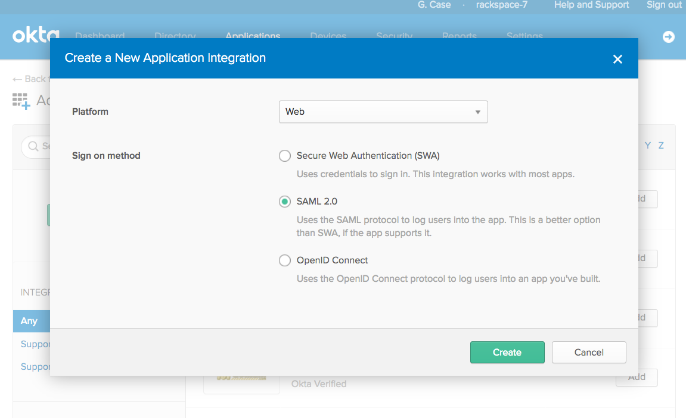
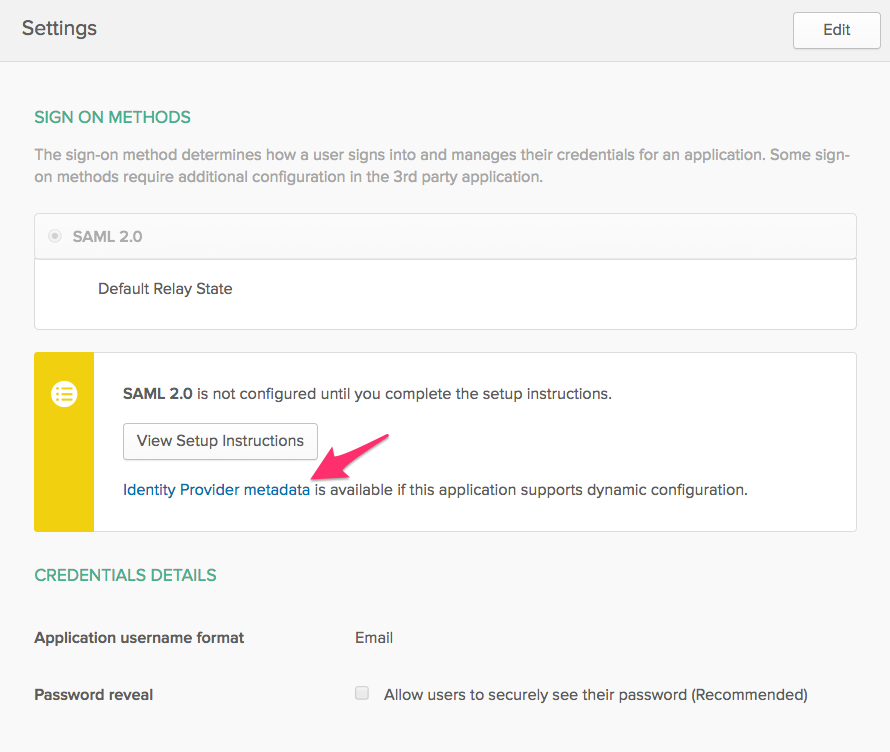

.. _okta-setup-ug:

Prerequisites
-------------

You need the following things to set up Okta:

- Administrator access to your organization's Okta account.
- The information at :ref:`Rackspace Federation configuration details<generic-3p-saml-ug>`.

Configure Rackspace Federation at Okta
--------------------------------------

This section includes instructions that use the **Classic UI** setting in Okta.

Follow these steps to set up SAML integration with Okta to work with |service|:

1. Log in to your organization's Okta account by using your organization's sign-in
   page.

2. Click **Applications** located on the top ribbon.

3. On the next screen, click the **Add Application** button.

4. Next, click the **Create New Application** button.

5. From within the **Configure a New Application Integration** pop-up window,
   select **Web** from the **Platform** options and **SAML 2.0** from the
   **Sign on method** options.

6. On the **General Settings** page, fill in the **App name** with whatever you
   want users to see when they use the application and then click **Next**.

7. Fill in the requested SAML information with the :ref:`Rackspace Federation
   configuration details<generic-3p-saml-ug>`.

The default values are shown in the following list:

.. list-table::
   :widths: 30 70
   :header-rows: 1

   * - Attribute
     - Value
   * - Assertion Consumer Service
       ("Single Sign On URL")
     - https://login.rackspace.com/federate/acs
   * - EntityID ("Audience")
     - https://login.rackspace.com
   * - Application username
     - Email (recommended)

8. On the same screen, proceed to the section labeled **Attribute Statements**
   and enter the following values:

.. list-table::
   :widths: 30 30 50
   :header-rows: 1

   * - Name
     - Name format
     - Value
   * - email
     - Unspecified
     - user.email

9. In the same section, click the **Add Another** button and enter the following
   values:

.. list-table::
   :widths: 30 30 50
   :header-rows: 1

   * - Name
     - Name format
     - Value
   * - expire
     - Unspecified
     - PT4H (user is logged out after four hours). See the :ref:`expiration<Expire>`
       section for additional details.

10. Optionally, you can choose to add groups created in Okta to map to that
    to be mapped to Rackspace permissions later. This can be done by performing
    the following steps:

        1. In the section **Group Attribute Statements (Optional)**, enter a
        name for the group attribute statement in the **Name** field.

        2. Leave **Name format** set to **Unspecified**.

        3. Choose a **Filter** option and enter the necessary details. For
        example, if you want to include all the user's groups that have the
        word ``rackspace`` in your SAML assertions, add a field with an
        appropriate name like ``groups``, and select a regex filter with the
        value ``.*rackspace.*``.

11. Click **Next**. You can fill out the next page however you prefer and then
    click **Finish**.

You have successfully added Rackspace Federation to your Okta account.

.. _okta-metadata:

Okta metadata
-------------

Before leaving this page, download your Okta |idp| metadata by going to the new
SAML applications settings and going to the **Sign On** section. Click the
**Identity Provider metadata** link to download the XML file. This file is
necessary to configure your |idp| with Rackspace. The file should be
**metadata.xml**.

**Note:** If the file does not download with the **.xml** extension, be sure to
rename the file with the **.xml** extension before uploading at Rackspace.

Next steps
----------

After you have added Rackspace Federation as an application at Okta, you should
add Okta as an |idp| at Rackspace by using one of the
following methods:

   - :ref:`Add an Identity Provider in the Control Panel<add-idp-cp-gs-ug>`.

   - :ref:`Add an Identity Provider in the MyRack Portal<add-idp-mr-gs-ug>`.

   - :ref:`Add an Identity Provider by using the API<add-idp-api-gs-ug>` by
     providing basic information about the |idp|.

Optional settings
-----------------

Unless specified in the instructions above, all other Okta settings are
optional. For further detail on all Okta SAML configuration options, see
the :ref:`Okta documentation site<
https://developer.okta.com/standards/SAML/setting_up_a_saml_application_in_okta
>`.
