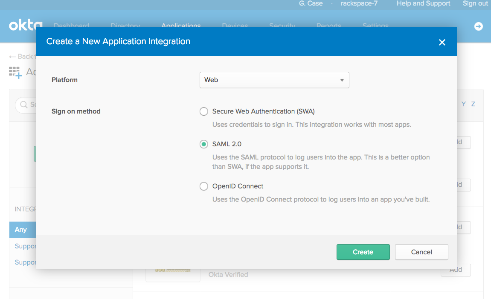

.. _okta-setup-ug:

================
Configuring Okta
================

These are the steps to setup a SAML integration with Okta to work with
|service|.

1. Configure a new application integration and select
**SAML 2.0**

Instructions on setting up SAML applications in Okta can be found here:
https://developer.okta.com/standards/SAML/setting_up_a_saml_application_in_okta

2. Fill in the requested SAML information with Rackspace information.
The default values are listed below, but can also be retrieved programmatically
from the Rackspace service provider metadata file at:
`https://login.rackspace.com/federate/sp.xml
<https:login.rackspace.com/federate/sp.xml>`_

The metadata file will also always contain the latest certificate for signing
SAML assertions.

.. list-table::
   :widths: 30 70
   :header-rows: 1

   * - Attribute
     - Value
   * - EntityID ("Audience")
     - https://login.rackspace.com
   * - Assertion Consumer Service
       ("Single Sign On URL")
     - https://login.rackspace.com/federate/acs
   * - Single Logout Service
     - https://login.rackspace.com/federate/sls

3. Download your Okta |idp| metadata by going to the new SAML applications
settings and going to the "Sign On" section. Click the "Identity Provider
metadata" link to download the XML file that you will use to configure your
|idp| with Rackspace.

.. image:: idp_metadata.png

